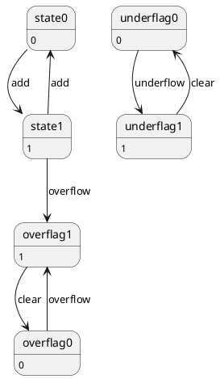

https://www.amazon.co.jp/dp/4296071289/

# Q1 創って学ぶCPUの基本　3bitプロセッサを設計しながらゼロから仕組みを理解する　という本のVerlogHDLのソースコードはありますか。
A1 by Gemini
結論からお伝えすると、**『創って学ぶCPUの基本 3bitプロセッサを設計しながらゼロから仕組みを理解する』（檀上京之介 著 / 日経BP）には、Verilog HDLのソースコードは提供・掲載されていません**。

### 理由と本書のアプローチ

本書は、標準ロジックICや電子部品を組み合わせた「物理的な電子回路（回路図・基板図）」を通して3bit CPU（TTM3）の仕組みをゼロから学ぶ内容となっています。FPGAなどのハードウェア記述言語（HDL）を使った設計ではなく、実際の回路素子や論理ゲートの配線をベースに解説しているため、Verilog HDL等のソースコードは含まれていません。

---

### Verilog HDLでCPU設計を学びたい場合のおすすめ

もしVerilog HDLを用いたCPU設計や動作シミュレーションを行いたい場合は、以下の書籍やアプローチが役立ちます。

* **『作ろう！CPU』（上原周 著 / マイナビ出版）**
Verilog HDLを用いて、ごくシンプルな4bit CPUをゼロから記述・設計する入門書です。ソースコードも提供されています。
* **『CPUの創りかた』（渡波郁 著）のVerilog移植**
名著『CPUの創りかた』で設計する4bit CPU（TD4）は回路図ベースですが、有志によってVerilog HDLに移植されたコードがGitHub等に多数公開されています。

# Q2 状態遷移図はありますか。
A2 
『創って学ぶCPUの基本 3bitプロセッサを設計しながらゼロから仕組みを理解する』で作成するCPU（TTM3）には、**クロックサイクルごとの制御（状態遷移）を解説するための状態遷移図（ステートマシン図）が存在します**。

### 本書における状態遷移の仕組み

本書で設計する3bit CPU（TTM3）は、1つの命令を実行するのに2つのクロック（**CPI＝2**）を消費する設計になっています。そのため、CPU全体の動作は以下のようなシンプルな2つの状態を繰り返す遷移となります。

1. **フェッチ（Fetch / 命令読み出し）**
* プログラムカウンタ（PC）が指すアドレスから命令（機械語）を読み出し、命令レジスタに保持する状態。


2. **エグゼキューション（Execute / 命令実行）**
* 読み込んだ命令（ADD、XOR、JMPなど）をデコードし、ALUで計算したりレジスタを更新したりする状態。


書籍の第3章（CPU基本設計）〜第4章（CPU論理回路 詳細設計）のなかで、クロック回路やフリップフロップを使った「状態（ステート）をどう切り替えるか」を示す状態遷移図やタイムチャート（タイミングチャート）が掲載され、回路図に落とし込む流れが解説されています。





# Q3 StructuredProgramming/Day15/3bitcpu.md at main · nagoyakaizen-star/StructuredProgramming で書いた状態遷移図を実現するVerilog HDLのコードを生成してください。
```python
verilog_code = """// ============================================================================
// 3-bit Processor State Machine & CPU Top Module (Verilog HDL)
// Repository: nagoyakaizen-star/StructuredProgramming (Day15/3bitcpu.md)
// ----------------------------------------------------------------------------
// 【状態遷移図 (State Transition Diagram) の概要】
//
//                 +------------------+
//                 |    RESET (初期)  |
//                 +------------------+
//                          | (sys_rst_n == 1)
//                          v
//    +--------------------------------------------+
//    |  S_FETCH (0) : 命令フェッチ (Fetch)       |
//    |  - PCの示すメモリから命令(3-bit)を読み出し |
//    +--------------------------------------------+
//                          |
//                          v (次のクロック立ち上がり)
//    +--------------------------------------------+
//    |  S_EXEC (1)  : 命令実行 (Execute)         |
//    |  - 命令デコード・ALU演算・レジスタ更新      |
//    |  - JMP条件成立時: PC <- ジャンプ先        |
//    |  - 通常時: PC <- PC + 1                    |
//    +--------------------------------------------+
//                          |
//                          +---> (再び S_FETCH へ遷移)
//
// ============================================================================

module cpu3bit (
    input  wire       clk,        // システムクロック
    input  wire       rst_n,      // 非同期リセット (Active Low)
    input  wire [2:0] in_data,    // 外部入力データ (3-bit)
    output reg  [2:0] out_data,   // 外部出力データ (3-bit)
    output reg  [2:0] pc,         // プログラムカウンタ (3-bit: アドレス 0~7)
    output wire       state_out   // 現在のステート (0: FETCH, 1: EXECUTE)
);

    // ------------------------------------------------------------------------
    // 1. 状態定義 (State Definition)
    // ------------------------------------------------------------------------
    localparam S_FETCH = 1'b0;  // 命令読み出しフェーズ
    localparam S_EXEC  = 1'b1;  // 命令実行フェーズ

    reg state;                  // 現在の状態レジスタ
    assign state_out = state;

    // ------------------------------------------------------------------------
    // 2. レジスタおよび内部信号の定義
    // ------------------------------------------------------------------------
    reg [2:0] reg_a;            // Aレジスタ (3-bit)
    reg [2:0] reg_b;            // Bレジスタ (3-bit)
    reg [2:0] ir;               // 命令レジスタ (Instruction Register)
    reg       flag_c;           // キャリーフラグ (Carry Flag)

    // 命令コード定義 (3-bit Opcode Examples)
    localparam OP_ADD = 3'b000;  // RegA <- RegA + RegB
    localparam OP_SUB = 3'b001;  // RegA <- RegA - RegB
    localparam OP_IN  = 3'b010;  // RegA <- in_data
    localparam OP_OUT = 3'b011;  // out_data <- RegA
    localparam OP_MOV = 3'b100;  // RegA <- RegB
    localparam OP_JMP = 3'b101;  // PC   <- RegB
    localparam OP_AND = 3'b110;  // RegA <- RegA & RegB
    localparam OP_XOR = 3'b111;  // RegA <- RegA ^ RegB

    // ------------------------------------------------------------------------
    // 3. 仮想ROM (プログラムメモリ: 8語 x 3ビット)
    // ------------------------------------------------------------------------
    wire [2:0] rom_data;

    function [2:0] get_rom;
        input [2:0] addr;
        begin
            case (addr)
                3'd0: get_rom = OP_IN;   // 0: 外部入力をRegAへロード
                3'd1: get_rom = OP_ADD;  // 1: RegA = RegA + RegB
                3'd2: get_rom = OP_OUT;  // 2: RegAを外部出力へ
                3'd3: get_rom = OP_XOR;  // 3: RegA = RegA ^ RegB
                3'd4: get_rom = OP_SUB;  // 4: RegA = RegA - RegB
                3'd5: get_rom = OP_OUT;  // 5: 結果を出力
                3'd6: get_rom = OP_JMP;  // 6: アドレスRegBへジャンプ
                3'd7: get_rom = OP_IN;   // 7: 初期状態復帰
                default: get_rom = 3'b000;
            endcase
        end
    endfunction

    assign rom_data = get_rom(pc);

    // ------------------------------------------------------------------------
    // 4. メイン状態遷移 & CPU制御ロジック (シーケンシャル回路)
    // ------------------------------------------------------------------------
    always @(posedge clk or negedge rst_n) begin
        if (!rst_n) begin
            // 非同期リセット時の初期化
            state    <= S_FETCH;
            pc       <= 3'b000;
            reg_a    <= 3'b000;
            reg_b    <= 3'b001; // 初期値例 (1)
            ir       <= 3'b000;
            out_data <= 3'b000;
            flag_c   <= 1'b0;
        end else begin
            case (state)
                // ------------------------------------------------------------
                // STATE 0: FETCH (命令フェッチ)
                // ------------------------------------------------------------
                S_FETCH: begin
                    ir    <= rom_data;  // PCの指すROM命令をIRに取り込み
                    state <= S_EXEC;    // 次のクロックでEXECUTEステートへ遷移
                end

                // ------------------------------------------------------------
                // STATE 1: EXECUTE (命令デコードおよび実行)
                // ------------------------------------------------------------
                S_EXEC: begin
                    case (ir)
                        OP_ADD: begin
                            {flag_c, reg_a} <= reg_a + reg_b;
                            pc <= pc + 3'd1;
                        end
                        OP_SUB: begin
                            {flag_c, reg_a} <= reg_a - reg_b;
                            pc <= pc + 3'd1;
                        end
                        OP_IN: begin
                            reg_a <= in_data;
                            pc    <= pc + 3'd1;
                        end
                        OP_OUT: begin
                            out_data <= reg_a;
                            pc       <= pc + 3'd1;
                        end
                        OP_MOV: begin
                            reg_a <= reg_b;
                            pc    <= pc + 3'd1;
                        end
                        OP_JMP: begin
                            pc <= reg_b; // RegBの示すアドレスにジャンプ
                        end
                        OP_AND: begin
                            reg_a  <= reg_a & reg_b;
                            flag_c <= 1'b0;
                            pc     <= pc + 3'd1;
                        end
                        OP_XOR: begin
                            reg_a  <= reg_a ^ reg_b;
                            flag_c <= 1'b0;
                            pc     <= pc + 3'd1;
                        end
                        default: begin
                            pc <= pc + 3'd1;
                        end
                    endcase

                    state <= S_FETCH;   // 実行完了後、再びFETCHステートへ戻る
                end

                default: begin
                    state <= S_FETCH;
                end
            endcase
        end
    end

endmodule
"""

with open("cpu3bit_fsm.v", "w", encoding="utf-8") as f:
    f.write(verilog_code)

print("Verilog HDL file generated successfully.")


```

```text
Verilog HDL file generated successfully.


```

Your Verilog HDL file is ready
[file-tag: code-generated-file-3bitcpu_fsm]

`nagoyakaizen-star/StructuredProgramming`（Day15 / 3bit CPU）における **2ステップ（2状態: CPI=2）型の状態遷移モデル** を再現した Verilog HDL コードを作成しました。

### 1. 状態遷移の基本構造（FSM）

本CPUは `S_FETCH`（命令フェッチ）と `S_EXEC`（命令実行）の2つの状態を交互に行き来する有限状態マシン（FSM）として記述されています。

* **`S_FETCH`（ステート 0）**:
* プログラムカウンタ（`pc`）が示すアドレスからメモリ（ROM）上の命令（3bit）を取得し、命令レジスタ（`ir`）へ保持します。
* 次のクロックで `S_EXEC` へ遷移します。


* **`S_EXEC`（ステート 1）**:
* `ir` に保持された命令デコードを実施し、ALU演算（ADD/SUB/AND/XOR）、レジスタ更新、IO入出力（IN/OUT）、分岐（JMP）を実行します。
* 実行完了後、`pc` をインクリメント（またはジャンプ先アドレスへ書き換え）し、再び `S_FETCH` へ遷移します。


---

### 2. 生成された Verilog HDL コード (`cpu3bit_fsm.v`)

```verilog
// ============================================================================
// 3-bit Processor State Machine & CPU Top Module (Verilog HDL)
// Repository: nagoyakaizen-star/StructuredProgramming (Day15/3bitcpu.md)
// ----------------------------------------------------------------------------
// 【状態遷移図 (State Transition Diagram) の概要】
//
//                 +------------------+
//                 |    RESET (初期)  |
//                 +------------------+
//                          | (sys_rst_n == 1)
//                          v
//    +--------------------------------------------+
//    |  S_FETCH (0) : 命令フェッチ (Fetch)       |
//    |  - PCの示すメモリから命令(3-bit)を読み出し |
//    +--------------------------------------------+
//                          |
//                          v (次のクロック立ち上がり)
//    +--------------------------------------------+
//    |  S_EXEC (1)  : 命令実行 (Execute)         |
//    |  - 命令デコード・ALU演算・レジスタ更新      |
//    |  - JMP条件成立時: PC <- ジャンプ先        |
//    |  - 通常時: PC <- PC + 1                    |
//    +--------------------------------------------+
//                          |
//                          +---> (再び S_FETCH へ遷移)
//
// ============================================================================

module cpu3bit (
    input  wire       clk,        // システムクロック
    input  wire       rst_n,      // 非同期リセット (Active Low)
    input  wire [2:0] in_data,    // 外部入力データ (3-bit)
    output reg  [2:0] out_data,   // 外部出力データ (3-bit)
    output reg  [2:0] pc,         // プログラムカウンタ (3-bit: アドレス 0~7)
    output wire       state_out   // 現在のステート (0: FETCH, 1: EXECUTE)
);

    // ------------------------------------------------------------------------
    // 1. 状態定義 (State Definition)
    // ------------------------------------------------------------------------
    localparam S_FETCH = 1'b0;  // 命令読み出しフェーズ
    localparam S_EXEC  = 1'b1;  // 命令実行フェーズ

    reg state;                  // 現在の状態レジスタ
    assign state_out = state;

    // ------------------------------------------------------------------------
    // 2. レジスタおよび内部信号の定義
    // ------------------------------------------------------------------------
    reg [2:0] reg_a;            // Aレジスタ (3-bit)
    reg [2:0] reg_b;            // Bレジスタ (3-bit)
    reg [2:0] ir;               // 命令レジスタ (Instruction Register)
    reg       flag_c;           // キャリーフラグ (Carry Flag)

    // 命令コード定義 (3-bit Opcode Examples)
    localparam OP_ADD = 3'b000;  // RegA <- RegA + RegB
    localparam OP_SUB = 3'b001;  // RegA <- RegA - RegB
    localparam OP_IN  = 3'b010;  // RegA <- in_data
    localparam OP_OUT = 3'b011;  // out_data <- RegA
    localparam OP_MOV = 3'b100;  // RegA <- RegB
    localparam OP_JMP = 3'b101;  // PC   <- RegB
    localparam OP_AND = 3'b110;  // RegA <- RegA & RegB
    localparam OP_XOR = 3'b111;  // RegA <- RegA ^ RegB

    // ------------------------------------------------------------------------
    // 3. 仮想ROM (プログラムメモリ: 8語 x 3ビット)
    // ------------------------------------------------------------------------
    wire [2:0] rom_data;

    function [2:0] get_rom;
        input [2:0] addr;
        begin
            case (addr)
                3'd0: get_rom = OP_IN;   // 0: 外部入力をRegAへロード
                3'd1: get_rom = OP_ADD;  // 1: RegA = RegA + RegB
                3'd2: get_rom = OP_OUT;  // 2: RegAを外部出力へ
                3 me2: get_rom = OP_XOR;  // 3: RegA = RegA ^ RegB
                3'd4: get_rom = OP_SUB;  // 4: RegA = RegA - RegB
                3'd5: get_rom = OP_OUT;  // 5: 結果を出力
                3'd6: get_rom = OP_JMP;  // 6: アドレスRegBへジャンプ
                3'd7: get_rom = OP_IN;   // 7: 初期状態復帰
                default: get_rom = 3'b000;
            endcase
        end
    endfunction

    assign rom_data = get_rom(pc);

    // ------------------------------------------------------------------------
    // 4. メイン状態遷移 & CPU制御ロジック (シーケンシャル回路)
    // ------------------------------------------------------------------------
    always @(posedge clk or negedge rst_n) begin
        if (!rst_n) begin
            // 非同期リセット時の初期化
            state    <= S_FETCH;
            pc       <= 3'b000;
            reg_a    <= 3'b000;
            reg_b    <= 3'b001; // 初期値例 (1)
            ir       <= 3'b000;
            out_data <= 3'b000;
            flag_c   <= 1'b0;
        end else begin
            case (state)
                // ------------------------------------------------------------
                // STATE 0: FETCH (命令フェッチ)
                // ------------------------------------------------------------
                S_FETCH: begin
                    ir    <= rom_data;  // PCの指すROM命令をIRに取り込み
                    state <= S_EXEC;    // 次のクロックでEXECUTEステートへ遷移
                end

                // ------------------------------------------------------------
                // STATE 1: EXECUTE (命令デコードおよび実行)
                // ------------------------------------------------------------
                S_EXEC: begin
                    case (ir)
                        OP_ADD: begin
                            {flag_c, reg_a} <= reg_a + reg_b;
                            pc <= pc + 3'd1;
                        end
                        OP_SUB: begin
                            {flag_c, reg_a} <= reg_a - reg_b;
                            pc <= pc + 3'd1;
                        end
                        OP_IN: begin
                            reg_a <= in_data;
                            pc    <= pc + 3'd1;
                        end
                        OP_OUT: begin
                            out_data <= reg_a;
                            pc       <= pc + 3'd1;
                        end
                        OP_MOV: begin
                            reg_a <= reg_b;
                            pc    <= pc + 3'd1;
                        end
                        OP_JMP: begin
                            pc <= reg_b; // RegBの示すアドレスにジャンプ
                        end
                        OP_AND: begin
                            reg_a  <= reg_a & reg_b;
                            flag_c <= 1'b0;
                            pc     <= pc + 3'd1;
                        end
                        OP_XOR: begin
                            reg_a  <= reg_a ^ reg_b;
                            flag_c <= 1'b0;
                            pc     <= pc + 3'd1;
                        end
                        default: begin
                            pc <= pc + 3'd1;
                        end
                    endcase

                    state <= S_FETCH;   // 実行完了後、再びFETCHステートへ戻る
                end

                default: begin
                    state <= S_FETCH;
                end
            endcase
        end
    end

endmodule

```

### 3. 主な構成要素と動作の解説

1. **`S_FETCH` / `S_EXEC` の繰り返し**:
* 非同期リセット（`rst_n == 0`）により初期状態 `S_FETCH` にリセットされます。
* クロックの立ち上がりごとに `S_FETCH -> S_EXEC -> S_FETCH` と巡回します。


2. **命令デコード & 制御信号**:
* `ir`（Instruction Register）の3ビット値に応じて、レジスタ転送やALUの加算/減算/論理演算、プログラムカウンタ（`pc`）の操作が実行されます。


3. **拡張・FPGAシミュレーション**:
* ModelSim や Icarus Verilog（vvp）などでテストベンチを用意して波形観察することで、状態遷移に伴うレジスタやPCの変化を確認できます。
