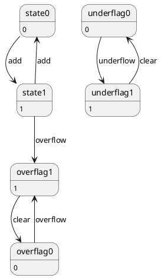

https://www.amazon.co.jp/%E5%89%B5%E3%81%A3%E3%81%A6%E5%AD%A6%E3%81%B6CPU%E3%81%AE%E5%9F%BA%E6%9C%AC-3bit%E3%83%97%E3%83%AD%E3%82%BB%E3%83%83%E3%82%B5%E3%82%92%E8%A8%AD%E8%A8%88%E3%81%97%E3%81%AA%E3%81%8C%E3%82%89%E3%82%BC%E3%83%AD%E3%81%8B%E3%82%89%E4%BB%95%E7%B5%84%E3%81%BF%E3%82%92%E7%90%86%E8%A7%A3%E3%81%99%E3%82%8B-%E6%AA%80%E4%B8%8A%E4%BA%AC%E4%B9%8B%E4%BB%8B/dp/4296071289/ref=sr_1_1?adgrpid=1316118182832403&dib=eyJ2IjoiMSJ9._yi5XDVj0mR4d10Vk_9zvI_fiZlxmA3rsmXEpXnvNjTGjHj071QN20LucGBJIEps.-1NTL1yXwT_FXCPnTj-eXsf20ZYLFi3c-YGwDWz3EYM&dib_tag=se&hvadid=82257635367235&hvbmt=be&hvdev=c&hvlocphy=140064&hvnetw=o&hvqmt=e&hvtargid=kwd-82258939525106%3Aloc-96&hydadcr=20960_13634701&jp-ad-ap=0&keywords=%E5%89%B5%E3%81%A3%E3%81%A6%E5%AD%A6%E3%81%B6cpu%E3%81%AE%E5%9F%BA%E6%9C%AC&mcid=51547d60b6b13f62924c5e53fc8cc2c7&msclkid=6a1a86f0bb89152ac13dec99f9d6c9b5&qid=1785283178&sr=8-1

# Q1 創って学ぶCPUの基本　3bitプロセッサを設計しながらゼロから仕組みを理解する　という本のVerlogHDLのソースコードはありますか。
A1 by Gemini
結論からお伝えすると、**『創って学ぶCPUの基本 3bitプロセッサを設計しながらゼロから仕組みを理解する』（檀上京之介 著 / 日経BP）には、Verilog HDLのソースコードは提供・掲載されていません**。

### 理由と本書のアプローチ

本書は、標準ロジックICや電子部品を組み合わせた「物理的な電子回路（回路図・基板図）」を通して3bit CPU（TTM3）の仕組みをゼロから学ぶ内容となっています。FPGAなどのハードウェア記述言語（HDL）を使った設計ではなく、実際の回路素子や論理ゲートの配線をベースに解説しているため、Verilog HDL等のソースコードは含まれていません。

---

### Verilog HDLでCPU設計を学びたい場合のおすすめ

もしVerilog HDLを用いたCPU設計や動作シミュレーションを行いたい場合は、以下の書籍やアプローチが役立ちます。

* **『作ろう！CPU』（上原周 著 / マイナビ出版）**
Verilog HDLを用いて、ごくシンプルな4bit CPUをゼロから記述・設計する入門書です。ソースコードも提供されています。
* **『CPUの創りかた』（渡波郁 著）のVerilog移植**
名著『CPUの創りかた』で設計する4bit CPU（TD4）は回路図ベースですが、有志によってVerilog HDLに移植されたコードがGitHub等に多数公開されています。

# Q2 状態遷移図はありますか。
A2 

