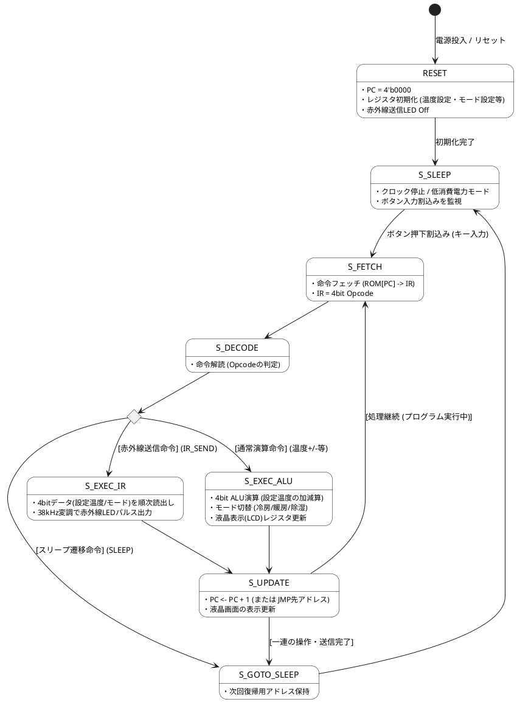

# Q1 エアコンのリモコンを制御できる4bit CPUの状態遷移図をPlantUMLで書いてください。
A1 by gemini
エアコンのリモコンを制御する **4bit CPU** の状態遷移図を PlantUML で作成しました。

一般的なCPUの基本サイクル（Fetch → Decode → Execute → Update）に加えて、リモコンの省電力化に必要な **「Sleep（スリープ/待機）状態」** や、エアコン特有の **「赤外線（IR）信号送信ステート」** を組み込んだ実践的な設計になっています。

---

### PlantUML 状態遷移図コード



---

### ステート（状態）の解説

1. **RESET（初期化）**
* リモコンに電池を入れた直後の状態。プログラムカウンタ（PC）やレジスタ（初期温度: 例 25℃、運転モード: 冷房など）を初期化します。


2. **S_SLEEP（省電力スリープ）**
* 電池を持続させるため、普段はCPUクロックを停止してスリープ状態になります。ボタン（電源、温度上下、モード切替）が押されると割り込みが発生し、動作を開始します。


3. **S_FETCH（命令取得）**
* ボタン入力に応じた処理プログラム（ROM）から4bitの命令（Opcode）を取り込みます。


4. **S_DECODE（命令解読）**
* 取り込んだ4bit命令が「温度加減算」「モード変更」「赤外線送信」「スリープ移行」のいずれであるかを判別します。


5. **S_EXEC_ALU（通常演算実行）**
* 4bit ALUを使用して、設定温度（18℃〜30℃等）の加減算や運転モードのインクリメントを行います。


6. **S_EXEC_IR（赤外線送信実行）**
* エアコン本体へ設定情報を送るため、レジスタ内の4bitデータをキャリア波（38kHzパルス）に乗せて赤外線LEDから順次送信します。


7. **S_UPDATE（PC更新・表示同期）**
* プログラムカウンタ（PC）を進め、リモコンの液晶（LCD）表示領域を新しい設定値に更新します。一連の処理が終わると再び `S_SLEEP` へ戻り、次のボタン操作を待ちます。


# Q2 上記状態機械のVerilog-HDLの記述をお願い。
エアコンのリモコン制御用 4bit CPU（スリープ機能・赤外線送信・温度/モード制御対応）の Verilog-HDL コードとテストベンチです。

動作確認しやすいよう、EDA Playground等のWeb環境でもそのままテストベンチでシミュレーションを実行できるように作成しています。

---

### 1. リモコン制御 4bit CPU トップモジュール (`aircon_remote_cpu4bit.v`)

```verilog
// ============================================================================
// 4-bit CPU Module for Air Conditioner Remote Controller
// Characteristics:
//   - Includes Sleep mode for battery power saving
//   - Supports IR Transmission, Temperature & Mode adjustments via 4-bit ALU
// ============================================================================

module aircon_remote_cpu4bit (
    input  wire       clk,          // システムクロック
    input  wire       rst_n,        // 非同期リセット (Active Low)
    input  wire       btn_interrupt,// ボタン押下割り込み (Sleep解除用)
    
    // 出力インターフェース
    output reg  [3:0] temp_lcd,     // LCD表示用 設定温度 (4bit: 18~30度)
    output reg  [1:0] mode_lcd,     // LCD表示用 運転モード (0:冷房, 1:暖房, 2:除湿)
    output reg        ir_led,       // 赤外線LED変調パルス出力 (IR Transmit)
    output reg        sleep_status, // CPUスリープ状態フラグ (1: Sleep中)
    output wire [2:0] current_state // モニタ用ステート出力
);

    // ------------------------------------------------------------------------
    // 1. 状態定義 (FSM States)
    // ------------------------------------------------------------------------
    localparam S_RESET      = 3'b000; // 初期化ステート
    localparam S_SLEEP      = 3'b001; // 省電力スリープステート
    localparam S_FETCH      = 3'b010; // 命令フェッチ
    localparam S_DECODE     = 3'b011; // 命令デコード
    localparam S_EXEC_ALU   = 3'b100; // 温度・モード変更演算
    localparam S_EXEC_IR    = 3'b101; // 赤外線信号パルス送信
    localparam S_UPDATE     = 3'b110; // PC更新・LCD画面表示更新

    reg [2:0] state;
    assign current_state = state;

    // ------------------------------------------------------------------------
    // 2. レジスタおよび内部シグナル定義
    // ------------------------------------------------------------------------
    reg [3:0] pc;          // 4-bit プログラムカウンタ (0~15)
    reg [3:0] ir;          // 4-bit 命令レジスタ (Opcode)
    reg [3:0] reg_temp;    // 温度設定レジスタ (初期値: 4'd25 = 25℃)
    reg [1:0] reg_mode;    // 運転モードレジスタ (0:Cool, 1:Heat, 2:Dry)
    reg [3:0] ir_bit_count;// 赤外線シリアル送信用カウンタ

    // 4-bit Opcodes
    localparam OP_TEMP_UP   = 4'b0001; // 温度 +1℃
    localparam OP_TEMP_DOWN = 4'b0010; // 温度 -1℃
    localparam OP_MODE_CHG  = 4'b0100; // 運転モード切り替え
    localparam OP_SEND_IR   = 4'b1000; // 赤外線パルス送信
    localparam OP_GOTO_SLP  = 4'b1111; // スリープモードへ遷移

    // ------------------------------------------------------------------------
    // 3. 仮想プログラムROM (16語 x 4ビット)
    // ------------------------------------------------------------------------
    function [3:0] get_rom;
        input [3:0] addr;
        begin
            case (addr)
                4'd0: get_rom = OP_TEMP_UP;   // アドレス0: 温度をあげる
                4'd1: get_rom = OP_SEND_IR;   // アドレス1: 赤外線送信
                4'd2: get_rom = OP_MODE_CHG;  // アドレス2: モード変更
                4'd3: get_rom = OP_SEND_IR;   // アドレス3: 赤外線送信
                4'd4: get_rom = OP_GOTO_SLP;  // アドレス4: スリープへ移行
                default: get_rom = OP_GOTO_SLP;
            endcase
        end
    endfunction

    // ------------------------------------------------------------------------
    // 4. メイン FSM 制御シーケンス
    // ------------------------------------------------------------------------
    always @(posedge clk or negedge rst_n) begin
        if (!rst_n) begin
            state        <= S_RESET;
            pc           <= 4'd0;
            ir           <= 4'd0;
            reg_temp     <= 4'd25;  // 初期設定温度 25℃
            reg_mode     <= 2'd0;   // 初期モード: 冷房
            temp_lcd     <= 4'd25;
            mode_lcd     <= 2'd0;
            ir_led       <= 1'b0;
            sleep_status <= 1'b0;
            ir_bit_count <= 4'd0;
        end else begin
            case (state)

                // ------------------------------------------------------------
                // S_RESET: 初期化・スタートアップ
                // ------------------------------------------------------------
                S_RESET: begin
                    pc           <= 4'd0;
                    ir_led       <= 1'b0;
                    sleep_status <= 1'b0;
                    state        <= S_SLEEP; // 初期化完了後スリープへ
                end

                // ------------------------------------------------------------
                // S_SLEEP: 低消費電力待機モード (ボタン割り込み待ち)
                // ------------------------------------------------------------
                S_SLEEP: begin
                    sleep_status <= 1'b1;
                    ir_led       <= 1'b0;
                    if (btn_interrupt) begin // ボタン押下による割り込み判定
                        sleep_status <= 1'b0;
                        state        <= S_FETCH; // 処理開始
                    end
                end

                // ------------------------------------------------------------
                // S_FETCH: 命令読み出し
                // ------------------------------------------------------------
                S_FETCH: begin
                    ir    <= get_rom(pc);
                    state <= S_DECODE;
                end

                // ------------------------------------------------------------
                // S_DECODE: 命令のデコードと分岐
                // ------------------------------------------------------------
                S_DECODE: begin
                    if (ir == OP_SEND_IR) begin
                        ir_bit_count <= 4'd0;
                        state        <= S_EXEC_IR;  // 赤外線送信処理へ
                    end else if (ir == OP_GOTO_SLP) begin
                        state        <= S_SLEEP;    // スリープ遷移へ
                    end else begin
                        state        <= S_EXEC_ALU; // 通常のALU演算へ
                    end
                end

                // ------------------------------------------------------------
                // S_EXEC_ALU: 4bit ALUによる演算 (温度上限/下限制限付き)
                // ------------------------------------------------------------
                S_EXEC_ALU: begin
                    case (ir)
                        OP_TEMP_UP: begin
                            if (reg_temp < 4'd30) reg_temp <= reg_temp + 4'd1; // 上限 30℃
                        end
                        OP_TEMP_DOWN: begin
                            if (reg_temp > 4'd18) reg_temp <= reg_temp - 4'd1; // 下限 18℃
                        end
                        OP_MODE_CHG: begin
                            if (reg_mode == 2'd2) reg_mode <= 2'd0;
                            else                  reg_mode <= reg_mode + 2'd1;
                        end
                        default: ;
                    endcase
                    state <= S_UPDATE;
                end

                // ------------------------------------------------------------
                // S_EXEC_IR: 赤外線変調信号の生成・パルス送信
                // ------------------------------------------------------------
                S_EXEC_IR: begin
                    // キャリア波模倣（クロックの立ち上がりでLEDトグル制御）
                    ir_led <= ~ir_led;
                    ir_bit_count <= ir_bit_count + 4'd1;

                    // 一定カウントパルス送信完了後にUPDATEへ移行
                    if (ir_bit_count == 4'd7) begin
                        ir_led <= 1'b0;
                        state  <= S_UPDATE;
                    end
                end

                // ------------------------------------------------------------
                // S_UPDATE: プログラムカウンタ更新・液晶表示同期
                // ------------------------------------------------------------
                S_UPDATE: begin
                    temp_lcd <= reg_temp; // LCDレジスタ同期
                    mode_lcd <= reg_mode;
                    pc       <= pc + 4'd1;
                    state    <= S_FETCH;  // 次の命令へ
                end

                default: state <= S_SLEEP;

            endcase
        end
    end

endmodule

```

---

### 2. シミュレーション用テストベンチ (`tb_aircon_remote_cpu4bit.v`)

スリープ状態からのボタン割り込み復帰、温度変更演算、赤外線送信、スリープ再遷移の挙動を追うテストベンチです。

```verilog
`timescale 1ns/1ps

module tb_aircon_remote_cpu4bit;
    reg        clk;
    reg        rst_n;
    reg        btn_interrupt;

    wire [3:0] temp_lcd;
    wire [1:0] mode_lcd;
    wire       ir_led;
    wire       sleep_status;
    wire [2:0] current_state;

    // DUT (Device Under Test) インスタンス
    aircon_remote_cpu4bit uut (
        .clk(clk),
        .rst_n(rst_n),
        .btn_interrupt(btn_interrupt),
        .temp_lcd(temp_lcd),
        .mode_lcd(mode_lcd),
        .ir_led(ir_led),
        .sleep_status(sleep_status),
        .current_state(current_state)
    );

    // 10ns 周期のクロック生成
    always #5 clk = ~clk;

    initial begin
        // 波形出力ファイル設定 (EDA Playground等のEPWave用)
        $dumpfile("dump.vcd");
        $dumpvars(0, tb_aircon_remote_cpu4bit);

        // 初期状態
        clk = 0; rst_n = 0; btn_interrupt = 0;

        #15 rst_n = 1; // リセット解除
        #20;

        // --- シナリオ 1: リモコンボタン押下（スリープ解除・復帰） ---
        $display("[Time %0t] ボタン押下: スリープ解除割り込み発生", $time);
        btn_interrupt = 1; #10;
        btn_interrupt = 0;

        // --- シナリオ 2: プログラムシーケンスの観察 ---
        // ROM 0: OP_TEMP_UP  -> 温度 25℃ -> 26℃
        // ROM 1: OP_SEND_IR  -> 赤外線LEDパルス送信
        // ROM 2: OP_MODE_CHG -> モード切り替え
        // ROM 3: OP_SEND_IR  -> 赤外線LEDパルス送信
        // ROM 4: OP_GOTO_SLP -> 再びスリープモードへ
        #300;

        $display("[Time %0t] 最終状態 - 温度LCD: %0d℃, モードLCD: %0d, Sleep: %b", 
                 $time, temp_lcd, mode_lcd, sleep_status);

        $finish;
    end
endmodule

```

---

### EDA Playground等での観察ポイント

* **`S_SLEEP` 状態での挙動**: リセット解除後は `sleep_status = 1`（低消費電力スリープ）になり、`btn_interrupt` パルスを受け取るまで待機します。
* **`S_EXEC_ALU` でのデータ変化**: `OP_TEMP_UP`（温度上げ命令）の実行により `reg_temp` が 25℃ → 26℃ に更新され、`S_UPDATE` で `temp_lcd` に反映されます。
* **`S_EXEC_IR` での信号発生**: 赤外線送信命令時に `ir_led` がトグル動作して搬送波パルスを出力します。
* **`OP_GOTO_SLP` による再スリープ**: ROM上のスリープ命令により、処理が一通り終わると自動的に `S_SLEEP` へ戻ります。

```exec
 Log Share
[2026-07-29 01:40:16 UTC] iverilog '-Wall' '-g2012' design.sv testbench.sv  && unbuffer vvp a.out  
testbench.sv:8: warning: timescale for aircon_remote_cpu4bit inherited from another file.
design.sv:1: ...: The inherited timescale is here.
testbench.sv:76: warning: Numeric constant truncated to 4 bits.
testbench.sv:78: warning: Numeric constant truncated to 4 bits.
testbench.sv:136: warning: Numeric constant truncated to 4 bits.
testbench.sv:139: warning: Numeric constant truncated to 4 bits.
VCD info: dumpfile dump.vcd opened for output.
[Time 35000] ?????: ????????????
[Time 345000] ???? - ??LCD: 10?, ???LCD: 1, Sleep: 0
design.sv:56: $finish called at 345000 (1ps)
Finding VCD file...
```
