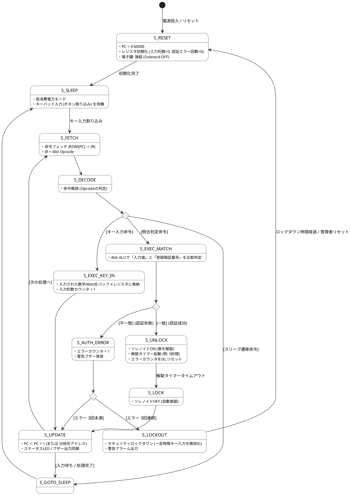

# Q1 扉をあける電子鍵を４bitCPUの状態遷移をplantUMLで記述してください。
A1 by gemini

電子鍵（スマートロック）を制御する **4bit CPU** の状態遷移図を PlantUML で作成しました。

防犯性・実用性を考慮し、一般的な CPU サイクル（Fetch → Decode → Execute）に加え、**「キーパッド入力受付（暗証番号照合）」「暗証番号一致判定（ALU判定）」「ソレノイド（解錠機構）駆動」「パスワード試行回数エラーによるセキュリティロック（アラーム）」** を組み込んだ状態遷移となっています。

---

### PlantUML 状態遷移図コード

---

### ステート（状態）の解説

1. **S_RESET（初期化）**
* システム起動時の初期化処理。電子鍵を確実に施錠（ソレノイドOFF）し、入力バッファや認証エラー回数をリセットします。

2. **S_SLEEP（待機・省電力）**
* 電池消耗を抑えるため普段はスリープ状態です。テンキーのいずれかのボタンが押されると割り込み信号が発生し、復帰します。

3. **S_FETCH / S_DECODE（命令読み出し・解読）**
* ROMから4bitの命令（Opcode）を取り出し、テンキー入力処理・暗証番号照合・スリープ移行などの動作パターンを判別します。

4. **S_EXEC_KEY_IN（キー入力受け取り）**
* 押されたテンキーの4bit数値データを入力バッファ（レジスタ）に保存し、入力桁数を更新します。

5. **S_EXEC_MATCH（暗証番号照合）**
* 4bit ALU（論理演算回路）を用いて、入力された暗証番号と内部ROMに保持された正解コードを比較します。

6. **S_UNLOCK / S_LOCK（解錠・自動再施錠）**
* **認証成功時:** ソレノイドを駆動させてソレノイドをONにし、扉を解錠します。一定時間（オートロックタイマー）経過後、自動的に再施錠（S_LOCK）します。

7. **S_AUTH_ERROR / S_LOCKOUT（失敗処理・防犯ロックダウン）**
* **認証失敗時:** エラーカウンタをインクリメントし、失敗ブザーを鳴らします。
* **3回連続失敗時:** いたずら・不正解錠を防ぐため `S_LOCKOUT`（一定時間の操作不可・警告アラーム）へ遷移します。

> **提示したアーキテクチャのポイント**
> 必要に応じて、このPlantUML状態遷移図をベースにした **Verilog HDLソースコード** や **テストベンチ（シミュレーション環境）** の作成も可能です。

