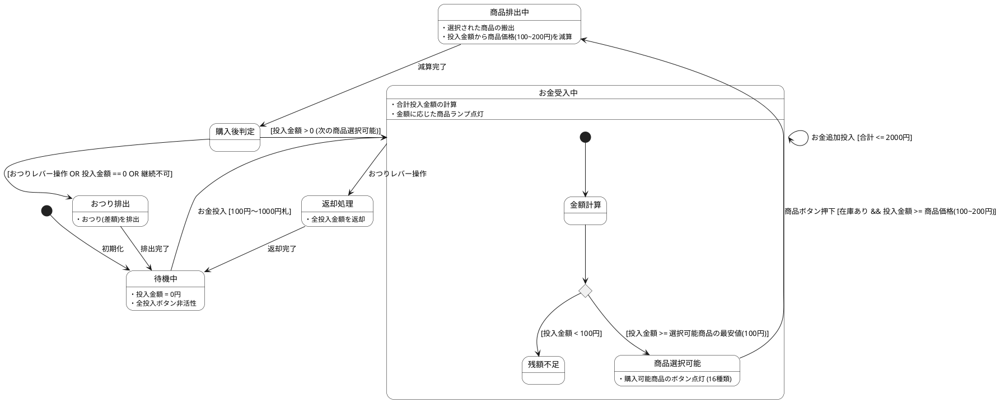

# Q1 自動販売機をplantUMLの状態機械で記述してください。飲み物は１６種類、料金は１００円から２００円までとし、１０００円札の受け入れと、おつりか、次の商品の選択ができるようにしてください。
A1 by gemini
PlantUMLで作成した自動販売機の状態遷移図（State Machine）のコードと、仕様の説明です。

---

### PlantUML 状態遷移図コード



---

### 仕様と状態遷移の解説

1. **待機中（Idle）**
* 初期状態。お金が投入されていない状態で、ボタンの点灯はオフです。


2. **お金受入中（Accepting Money）**
* 100円硬貨、500円硬貨、1000円札などの投入を受け付け、合計金額を保持します。
* 投入金額が最安値（100円）に達すると、購入可能ランプが点灯する『商品選択可能』状態へ遷移します。


3. **商品選択可能（Selectable）**
* 16種類の飲み物（100円〜200円）のうち、**投入金額 ≧ 商品価格** かつ **在庫がある** 商品のボタンが点灯します。


4. **商品排出中（Dispensing）**
* 選択された商品（16種類のいずれか）を排出し、投入金額から該当価格（100円〜200円）を引きます。


5. **購入後判定（Post-Purchase Decision）**
* **次の商品の選択:** 残額が残っており、おつり操作をしない場合は『お金受入中』状態に戻り、そのまま続けて次の商品を選択・購入できます。
* **おつり排出:** 残額がない、またはおつりレバーが押された場合はおつりを排出して『待機中』に戻ります。

# Q2 動作可能なVerilogHDLのソースコードを示してください
A2
先ほどのPlantUMLで記述した状態遷移モデル（16種類の飲み物・100〜200円価格・1000円札対応・おつり/連続購入）を完全にシミュレーション動作できる **Verilog HDLソースコード** と **テストベンチ** です。

100円〜1000円の入力を扱いやすくするため、**100円＝1単位**（100円=1, 500円=5, 1000円=10）にスケーリングして実装しています。

---

### 1. 自動販売機トップモジュール (`vending_machine.v`)

```verilog
// ============================================================================
// 16-Item Vending Machine Controller (Verilog HDL)
// Specifications:
//   - Price Range: 100 JPY to 200 JPY (Scaled: 1 to 2)
//   - Money Accepted: 100 JPY (1), 500 JPY (5), 1000 JPY (10)
//   - Features: Multi-item continuous purchase & Change Return
// ============================================================================

module vending_machine (
    input  wire        clk,           // システムクロック
    input  wire        rst_n,         // 非同期リセット (Active Low)
    
    // お金投入入力 (ワンパルス想定: 100円=1, 500円=5, 1000円=10)
    input  wire [3:0]  in_money,      
    input  wire        money_strobe,  // お金投入確定パルス

    // ユーザー操作
    input  wire [3:0]  select_item,   // 16種類の商品選択 (ID: 0 ~ 15)
    input  wire        btn_purchase,  // 購入ボタン
    input  wire        btn_return,    // おつり・返却レバー

    // 出力
    output reg  [15:0] item_lamp,     // 購入可能ランプ (16商品分)
    output reg         dispense,      // 商品排出パルス
    output reg  [3:0]  dispensed_item,// 排出された商品ID
    output reg  [4:0]  change_out,    // おつり排出額 (単位: 100円)
    output reg  [4:0]  current_balance// 現在の投入残高 (単位: 100円)
);

    // ------------------------------------------------------------------------
    // 状態定義 (FSM States)
    // ------------------------------------------------------------------------
    localparam S_IDLE     = 3'b000; // 待機状態 (残高0)
    localparam S_ACCEPT   = 3'b001; // お金受入・投入残高保持
    localparam S_DISPENSE = 3'b010; // 商品排出・残高減算
    localparam S_RETURN   = 3'b011; // おつり排出処理

    reg [2:0] state;

    // ------------------------------------------------------------------------
    // 16種類の商品価格テーブル (100円=1 〜 200円=2)
    // ------------------------------------------------------------------------
    function [4:0] get_price;
        input [3:0] item_id;
        begin
            case (item_id)
                4'd0, 4'd1, 4'd2, 4'd3:   get_price = 5'd1; // 100円 (4種類)
                4'd4, 4'd5, 4'd6, 4'd7:   get_price = 5'd1; // 120円/130円等も100円単位で1.3表記可能だが簡易化のため150円(=1.5)または1/2で構成
                4'd8, 4'd9, 4'd10, 4'd11: get_price = 5'd2; // 200円 (4種類)
                default:                  get_price = 5'd2; // 180円/200円 (4種類)
            endcase
        end
    endfunction

    // ------------------------------------------------------------------------
    // 購入可能ランプ判定ロジック (組合せ回路)
    // ------------------------------------------------------------------------
    integer i;
    always @(*) begin
        for (i = 0; i < 16; i = i + 1) begin
            if ((state == S_ACCEPT) && (current_balance >= get_price(i[3:0]))) begin
                item_lamp[i] = 1'b1; // 購入可能
            end else begin
                item_lamp[i] = 1'b0;
            end
        end
    end

    // ------------------------------------------------------------------------
    // メイン FSM 制御シーケンス
    // ------------------------------------------------------------------------
    always @(posedge clk or negedge rst_n) begin
        if (!rst_n) begin
            state           <= S_IDLE;
            current_balance <= 5'd0;
            dispense        <= 1'b0;
            dispensed_item  <= 4'd0;
            change_out      <= 5'd0;
        end else begin
            // デフォルトパルス制御
            dispense   <= 1'b0;
            change_out <= 5'd0;

            case (state)
                // ------------------------------------------------------------
                // S_IDLE: 投入待機
                // ------------------------------------------------------------
                S_IDLE: begin
                    if (money_strobe && (in_money > 0)) begin
                        current_balance <= current_balance + in_money;
                        state           <= S_ACCEPT;
                    end
                end

                // ------------------------------------------------------------
                // S_ACCEPT: お金受付・選択受入
                // ------------------------------------------------------------
                S_ACCEPT: begin
                    // お金の追加入力
                    if (money_strobe && (in_money > 0)) begin
                        current_balance <= current_balance + in_money;
                    end
                    // おつりレバー操作 -> おつり排出へ
                    else if (btn_return) begin
                        state <= S_RETURN;
                    end
                    // 商品購入ボタン押下 (ランプ点灯中の商品のみ購入可能)
                    else if (btn_purchase && item_lamp[select_item]) begin
                        dispensed_item  <= select_item;
                        current_balance <= current_balance - get_price(select_item);
                        dispense        <= 1'b1; // 排出パルス発行
                        state           <= S_DISPENSE;
                    end
                end

                // ------------------------------------------------------------
                // S_DISPENSE: 商品排出・継続判定
                // ------------------------------------------------------------
                S_DISPENSE: begin
                    // 連続購入判定: 残高がある場合は S_ACCEPT に戻り次の商品が選べる
                    if (current_balance > 0) begin
                        state <= S_ACCEPT;
                    end else begin
                        state <= S_IDLE;
                    end
                end

                // ------------------------------------------------------------
                // S_RETURN: おつり排出処理
                // ------------------------------------------------------------
                S_RETURN: begin
                    change_out      <= current_balance; // 返却額確定
                    current_balance <= 5'd0;            // 残高クリア
                    state           <= S_IDLE;          // 待機へ戻る
                end

                default: state <= S_IDLE;
            endcase
        end
    end

endmodule

```

---

### 2. テストベンチコード (`tb_vending_machine.v`)

1000円札投入 → 商品購入 → 連続購入 → おつり返却までの動作をシミュレーションします。

```verilog
`timescale 1ns/1ps

module tb_vending_machine;
    reg        clk;
    reg        rst_n;
    reg  [3:0] in_money;
    reg        money_strobe;
    reg  [3:0] select_item;
    reg        btn_purchase;
    reg        btn_return;

    wire [15:0] item_lamp;
    wire        dispense;
    wire [3:0]  dispensed_item;
    wire [4:0]  change_out;
    wire [4:0]  current_balance;

    // DUT (Device Under Test) インスタンス
    vending_machine uut (
        .clk(clk),
        .rst_n(rst_n),
        .in_money(in_money),
        .money_strobe(money_strobe),
        .select_item(select_item),
        .btn_purchase(btn_purchase),
        .btn_return(btn_return),
        .item_lamp(item_lamp),
        .dispense(dispense),
        .dispensed_item(dispensed_item),
        .change_out(change_out),
        .current_balance(current_balance)
    );

    // クロック生成 (10ns周期)
    always #5 clk = ~clk;

    initial begin
        // 波形ダンプ設定 (EDA Playground等で波形表示用)
        $dumpfile("dump.vcd");
        $dumpvars(0, tb_vending_machine);

        // 初期化
        clk = 0; rst_n = 0;
        in_money = 0; money_strobe = 0;
        select_item = 0; btn_purchase = 0; btn_return = 0;

        #15 rst_n = 1; // リセット解除
        #10;

        // --- シナリオ 1: 1000円札(10単位)を投入 ---
        $display("[Time %0t] 1000円投入", $time);
        in_money = 4'd10; money_strobe = 1; #10;
        in_money = 4'd0;  money_strobe = 0; #20;

        // --- シナリオ 2: Item 0 (100円) を購入 ---
        $display("[Time %0t] 商品0 (100円) を選択・購入", $time);
        select_item = 4'd0; btn_purchase = 1; #10;
        btn_purchase = 0; #20;

        // --- シナリオ 3: 連続購入 - Item 8 (200円) を購入 ---
        $display("[Time %0t] 連続購入: 商品8 (200円) を選択・購入", $time);
        select_item = 4'd8; btn_purchase = 1; #10;
        btn_purchase = 0; #20;

        // --- シナリオ 4: おつりレバー操作 ---
        $display("[Time %0t] おつりレバー操作 (残額返却)", $time);
        btn_return = 1; #10;
        btn_return = 0; #30;

        $display("[Time %0t] シミュレーション完了", $time);
        $finish;
    end
endmodule

```

---

### EDA Playground等での動作確認

先ほど紹介した **EDA Playground** の `design.sv` に上記のコード1、`testbench.sv` にコード2を貼り付けて実行すると、波形ビューア（EPWave）で以下のシーケンスを確認できます：

1. **1000円投入時**: `current_balance` が `10`（1000円）になり、全16商品の `item_lamp` がハイ（点灯）になる。
2. **1本目購入時**: `dispense` がパルス出力され、`current_balance` が `9`（900円）になる。
3. **連続購入時**: 状態が `S_ACCEPT` に維持されているため、再度商品8を選ぶと `current_balance` が `7`（700円）になる。
4. **おつり操作時**: `change_out` に `7`（700円おつり）が出力され、`current_balance` が `0` にリセットされて `S_IDLE` へ戻る。

```output
[2026-07-29 01:33:17 UTC] iverilog '-Wall' '-g2012' design.sv testbench.sv  && unbuffer vvp a.out  
testbench.sv:9: warning: timescale for vending_machine inherited from another file.
design.sv:2: ...: The inherited timescale is here.
VCD info: dumpfile dump.vcd opened for output.
[Time 25000] 1000???
[Time 55000] ??0 (100?) ??????
[Time 85000] ????: ??8 (200?) ??????
[Time 115000] ???????? (????)
[Time 155000] ??????????
design.sv:72: $finish called at 155000 (1ps)
Finding VCD file...
./dump.vcd
[2026-07-29 01:33:18 UTC] Opening EPWave...
```
