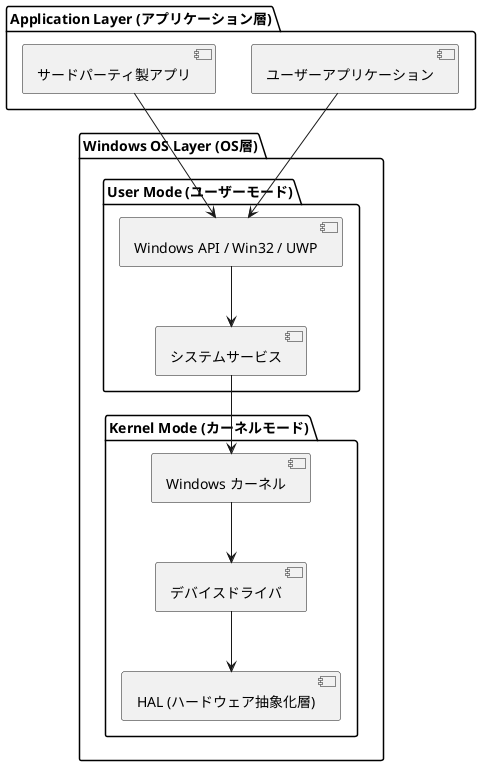

# Q1 WindowsのOSとアプリのPackage図をPlantUMLの形式で出力していただけませんか。
A1 by gemini
Windows OSとアプリケーションの一般的なレイヤー構造（階層関係）を表現したパッケージ図のPlantUMLコードです。

OSのコア（カーネル）からハードウェア抽象化層（HAL）、API、そして最上位のアプリケーションへと依存が流れる（アプリがOSの機能を利用する）関係性をモデリングしています。

### PlantUML コード



### 構造のポイント

* **レイヤーの分離:** 最上位の「アプリケーション層」が、下の「Windows OS層」に依存する綺麗な階層構造にしています。
* **ユーザーモードとカーネルモード:** Windows OSの重要なアーキテクチャ特性である、安全な実行空間の分離をパッケージのネストで表現しています。
* **下位への依存（求心/遠心の応用）:** アプリケーションの要求がAPIを通じて、最終的にハードウェアを制御するHAL（Hardware Abstraction Layer）へと伝わっていく流れを矢印で示しています。

#  Q2 このWindowsコンピュータに入っているすべてのソフトのPackage図を自動生成するにはどうしたらいいですか。
A2
Windowsに入っているすべてのソフトウェア（アプリケーションやドライバなど）を完全に自動検出して、自動でPlantUMLなどのパッケージ図に変換する「一発で完璧に解決する公式ボタン」のようなツールは残念ながら存在しません。

しかし、**「Windowsのコマンドでインストール済みソフト一覧を書き出す」＋「それを生成AIやスクリプトでPlantUML形式に整形する」** という2つのステップを組み合わせることで、自動生成に近い形で作ることは十分に可能です。

具体的な手順と、現実的なアプローチを3つ紹介します。

---

## アプローチ1：コマンドと生成AIを組み合わせる（最も簡単）

Windowsの標準機能を使ってインストールされているアプリの一覧をテキスト出力し、それをAI（私など）に渡してパッケージ図に変換させる方法です。

### ステップ1: パソコン内のソフト一覧を出力する

1. スタートボタンを右クリックし、「ターミナル」**または**「PowerShell」を開きます。
2. 以下のコマンドをコピーして貼り付け、Enterキーを押します。
```powershell
Get-Package | Select-Object Name, ProviderName | Out-File -FilePath "$env:USERPROFILE\Desktop\apps.txt"

```


3. デスクトップに `apps.txt` というファイルができ、そこにインストールされているソフトやライブラリの一覧が書き出されます。

### ステップ2: AIに図を生成させる

出力された `apps.txt` の中身をコピーし、以下のようにAI（ChatGPTやGeminiなど）に依頼します。

> **依頼プロンプトの例:**
> 「以下のWindowsのインストール済みソフト一覧を、カテゴリ（ブラウザ、開発ツール、システム系など）ごとに分類したPlantUMLのパッケージ図のコードに変換してください。[ここにテキストを貼り付け]」

---

## アプローチ2：PythonスクリプトでPlantUMLを自動出力する

もしプログラミング（Python）が少しできる環境であれば、レジストリからインストール情報を読み込んで、自動でPlantUMLのコード（`.puml`ファイル）を吐き出すスクリプトを自作できます。

以下は、Windowsのレジストリからアプリ名を取得し、簡易的なパッケージ図のテキストを自動生成するPythonスクリプトの例です。

```python
import winreg

def get_installed_apps():
    apps = []
    # 64bit/32bit両方のレジストリを確認
    paths = [
        r"SOFTWARE\Microsoft\Windows\CurrentVersion\Uninstall",
        r"SOFTWARE\Wow6432Node\Microsoft\Windows\CurrentVersion\Uninstall"
    ]
    for path in paths:
        try:
            key = winreg.OpenKey(winreg.HKEY_LOCAL_MACHINE, path)
            for i in range(winreg.QueryInfoKey(key)[0]):
                try:
                    sub_key_name = winreg.EnumKey(key, i)
                    sub_key = winreg.OpenKey(key, sub_key_name)
                    app_name, _ = winreg.QueryValueEx(sub_key, "DisplayName")
                    if app_name and app_name not in apps:
                        apps.append(app_name)
                except OSError:
                    continue
        except OSError:
            pass
    return apps

apps = get_installed_apps()

# PlantUML形式で出力
print("@startuml")
print("package \"Windows Installed Apps\" {")
for app in apps:
    # PlantUMLの特殊文字を排除してクリーンな名前に
    clean_name = "".join(c for c in app if c.isalnum() or c in " .-_")
    print(f'    [{clean_name}]')
print("}")
print("@enduml")

```

これを実行すると、自動的にすべてのソフトが1つのパッケージの中に並んだPlantUMLコードが出力されます。

---

## 現実的な問題点とアドバイス

自動生成を試みるにあたって、以下の点に注意してください。

* **依存関係（矢印）は自動生成できない：** Windowsのコマンドやレジストリから取得できるのは「名前のリスト」だけです。「どのアプリが、どのOS機能や別のアプリに依存しているか」という**矢印（関係性）の情報はパソコン内にデータとして存在しない**ため、自動で矢印を引くことはできません。関係性は手動で補う必要があります。
* **量が多すぎる：** 一般的なWindowsには、裏で動く細かいツールやアップデートプログラムを含めると**数百以上のソフト**が入っています。すべてをそのまま1つのパッケージ図にすると、画像が巨大化して何が何だかわからなくなります。

**おすすめの進め方：**
まずはアプローチ1のコマンドでリストを作り、その中から「自分が図に含めたい主要なアプリ（Office、ブラウザ、開発ツールなど10〜20個程度）」をピックアップして図にするのが、最も実用的で綺麗なパッケージ図になります。
