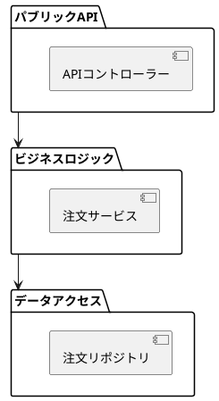
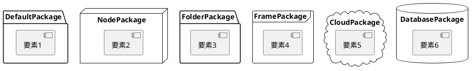
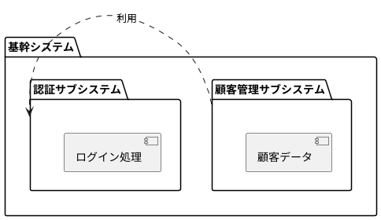
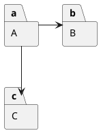
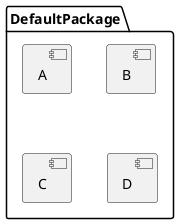
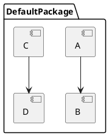

# Q1 Plant UML でパッケージ図を書くにはどうしたらいいですか。
A1 by Gemini
PlantUMLでパッケージ図（Package Diagram）を作成するのは非常にシンプルです。基本的には `package` キーワードを使って要素をグループ化していきます。

基本的な書き方から、よく使うテクニックまで分かりやすく解説します。

---

## 1. 基本的な書き方

最もシンプルなパッケージ図は、`package` の中にクラスやコンポーネント、あるいは別のパッケージを配置し、それらを矢印（`-->` や `..>`）で繋ぐことで作成できます。

---

## 2. パッケージの見た目（スタイル）を変える

PlantUMLでは、パッケージの枠線のデザイン（ステレオタイプ）をいくつか選ぶことができます。用途に合わせて使い分けると、より直感的な図になります。

* **`package` / `folder**`: 一般的なフォルダ形式の見た目です（デフォルト）。
* **`node`**: インフラ配置図（デプロイ図）などでサーバーなどを表す際によく使います。
* **`frame`**: 外枠だけのシンプルな四角形です。
* **`cloud` / `database**`: クラウドサービスやデータベース群をひとまとめにしたい時に便利です。

---

## 3. パッケージの入れ子（ネスト）

パッケージの中にさらにパッケージを入れることで、階層構造を表現できます。

---

## 4. レイアウトを整えるコツ（矢印の方向）

パッケージの配置が思い通りにならない場合は、矢印の記号を使って配置をコントロールできます。

* `-->` : 自動（通常は下方向）
* `-right->` または `->` : 右方向
* `-left->` : 左方向
* `-up->` : 上方向
* `-down->` : 下方向

※上記のように `as エリアス名` を使うと、依存関係を書くときに日本語の長いパッケージ名を使わずに済むのでコードがすっきりします。

